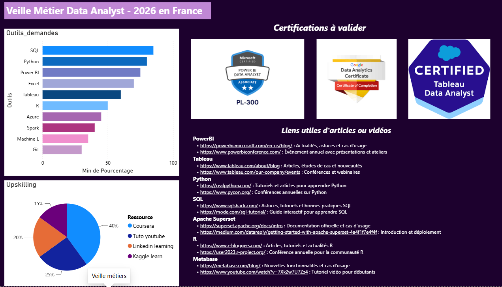
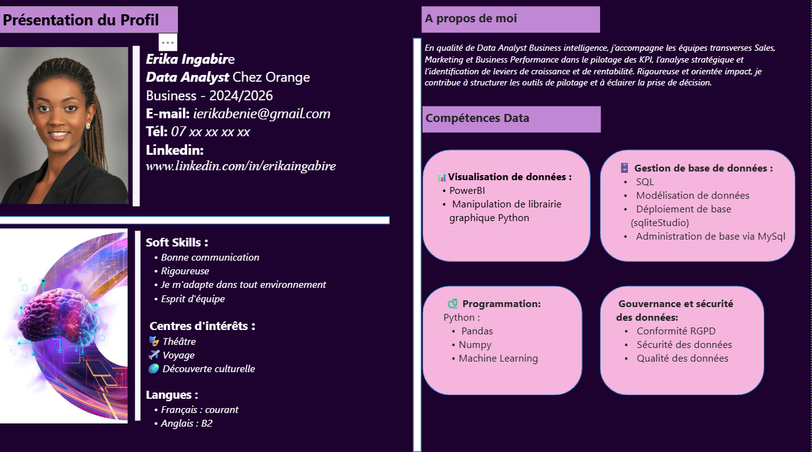

# Tableau de bord — Power BI

**Erika INGABIRE — Data Analyst | Projet Portfolio Aeroworld**

---

## Apercu

### Veille métier

### Profil

---

## Description

Tableau de bord interactif développé sous Power BI dans le cadre du projet portfolio Aeroworld. Il comprend deux vues complémentaires : une vue de veille métier pour le suivi des indicateurs sectoriels, et une vue profil pour l'analyse détaillée.

---

## Outils

Power BI · DAX · Power Query

---

## Fichier source

Le fichier .pbix est disponible sur demande.
